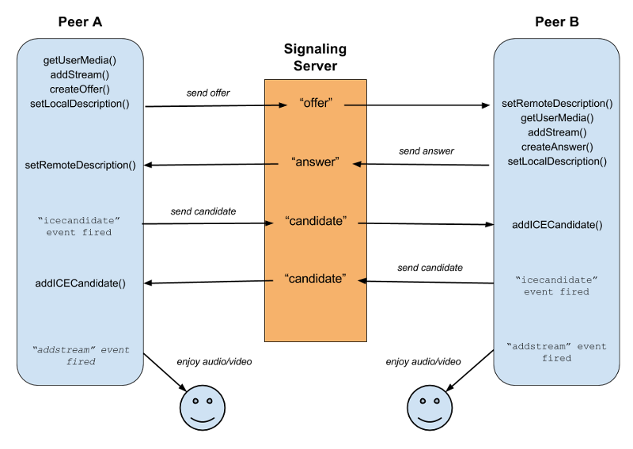

# Video Call

peer-to-peer video call using WebRTC

https://developer.mozilla.org/ko/docs/Web/API/WebRTC_API

#
  

#### 1. Peer A 가 채팅방 생성 -> myPeerConnection 생성  

#### 2. Peer B 가 채팅방 접속 

#### 3. Peer A 에서 welcome 이벤트 발생:  
    * createOffer()  
    * setLocalDescription()  
    * Signaling Server 로 offer 이벤트 전송
#### 4. Peer B 에서 offer 이벤트 발생  
    * offer 리시브  
    * setRemoteDescription()  
    * createAnswer()  
    * setLocalDescription()
    * Signaling Server 로 answer 이벤트 전송  
#### 5. Peer A 에서 answer 이벤트 발생  
    * answer 리시브
    * setRemoteDescription()
#### 6. IceCandidate event 발생
    * (Internet Connectivity Establishment, 인터넷 연결 생성):   
        WebRTC 에 필요한 프로토콜.
    * myPeerConnection 을 생성하면 IceCandidate event 를 실행
    * 반대쪽 Peer 에서 IceCandidate 리시브
    * addIceCandidate()
#### 7. AddStream event 발생
    * addStream event 발생시 상대방의 카메라가 보여질 video 태그의 srcObject 값 부여
    * peer-to-peer 화상채팅 가능!